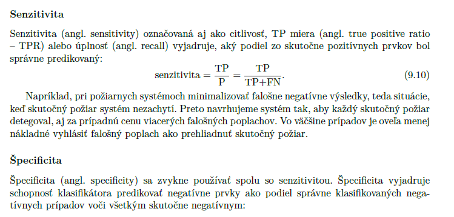

Pouzil som Random Forest - "Random Forest": {"n_estimators": [50, 100, 200], "max_depth": [5, 10, 20]},
		
sensitivty a specificity doplil som obidve, v USU ucebnici som cital, ze specificita sa pouziva so sensitivitou 

Vyslo mi ze Random Forest ma vacsie odchylku a nedava, tak konzistentne vysledky ako logisticka regresia. Logisticka regresia bola lepsia
vo vsetkych metrikach okrem specificity, kde boli priblizne rovnake vysledky. 

